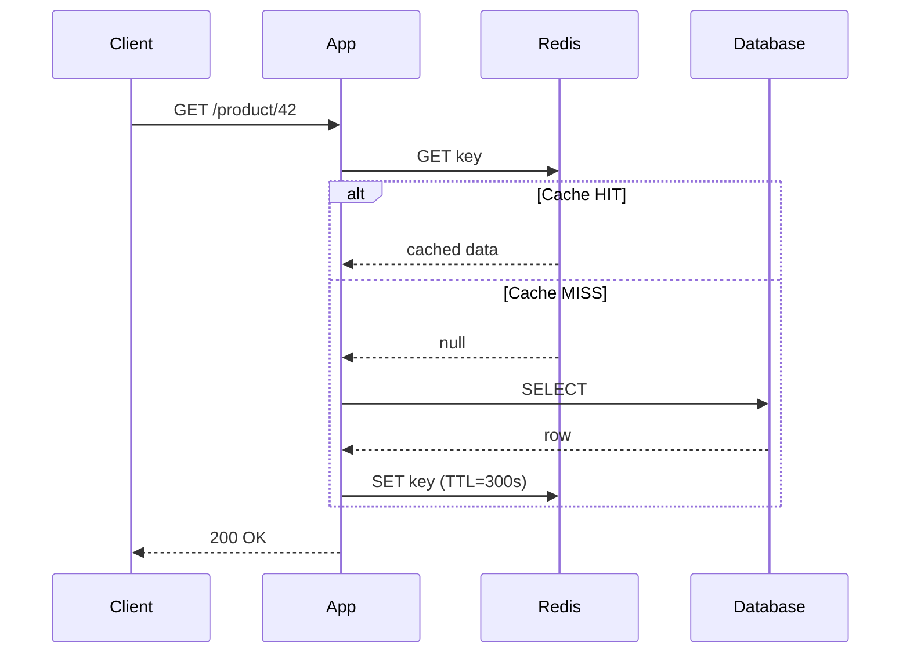
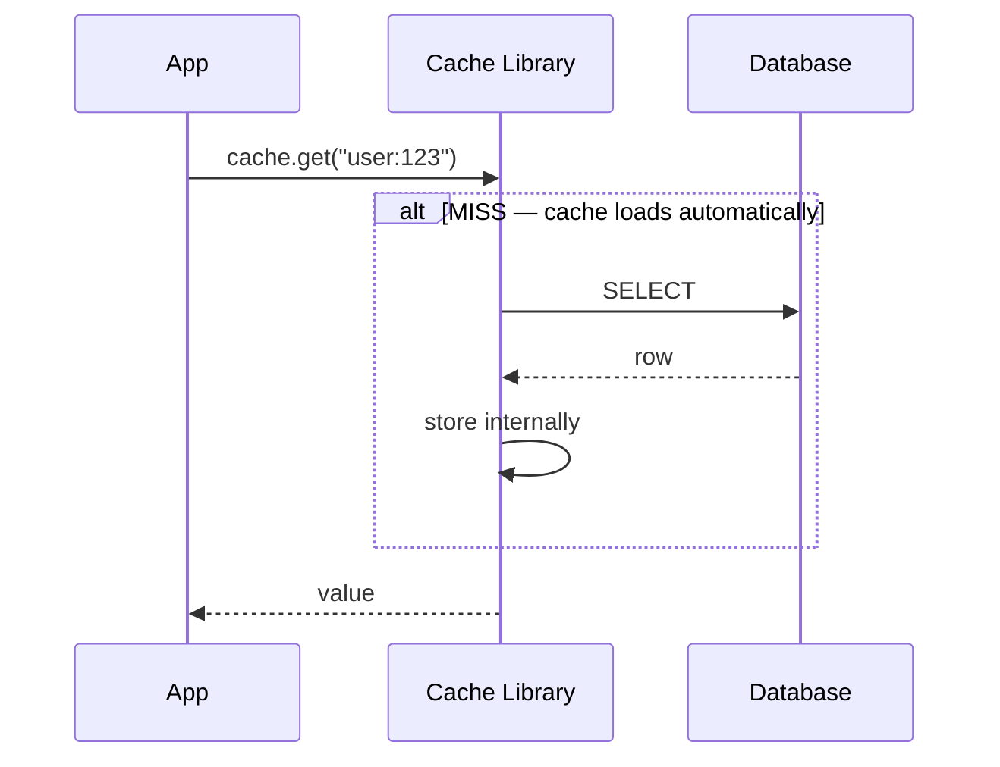
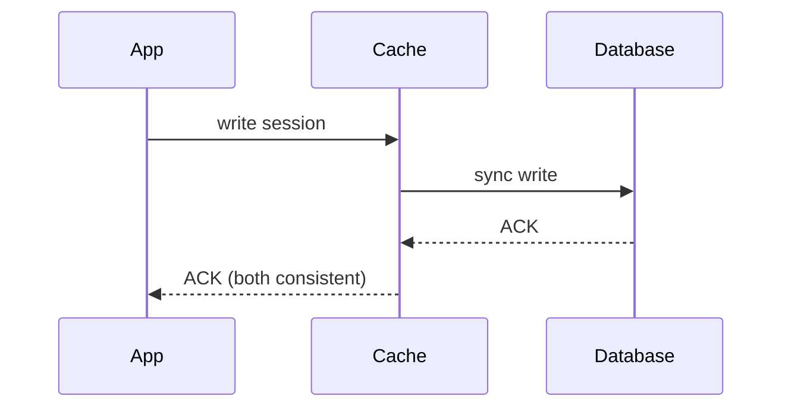
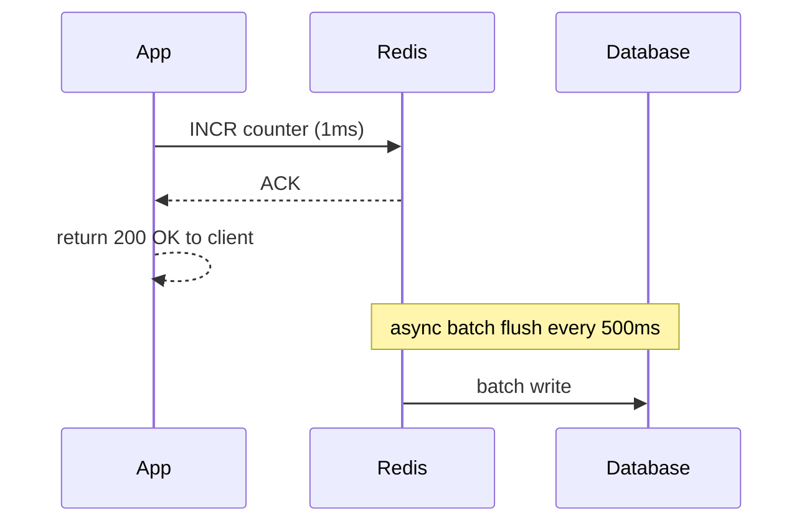
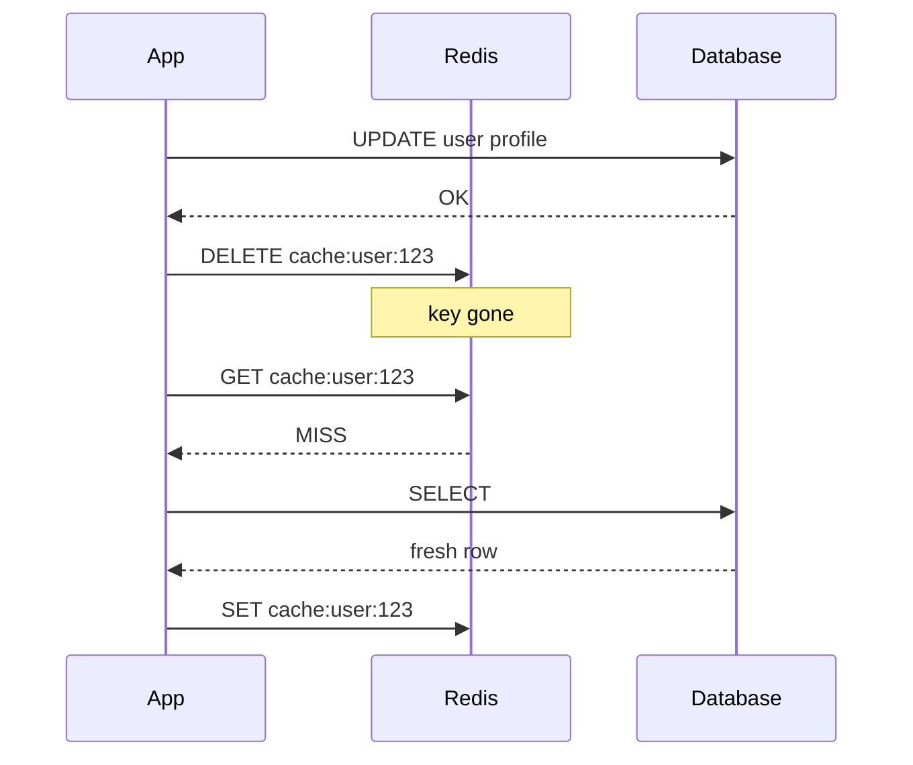
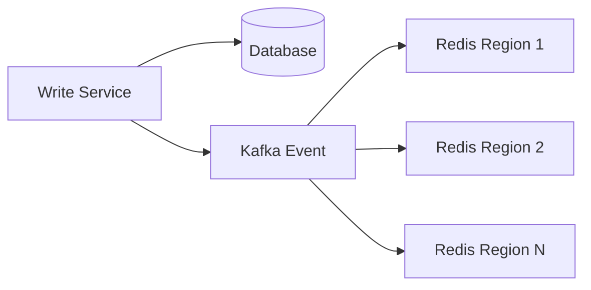
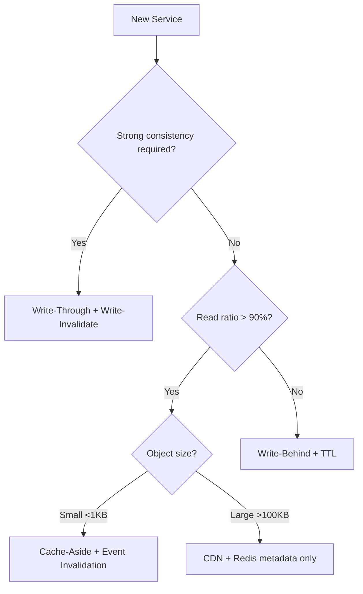
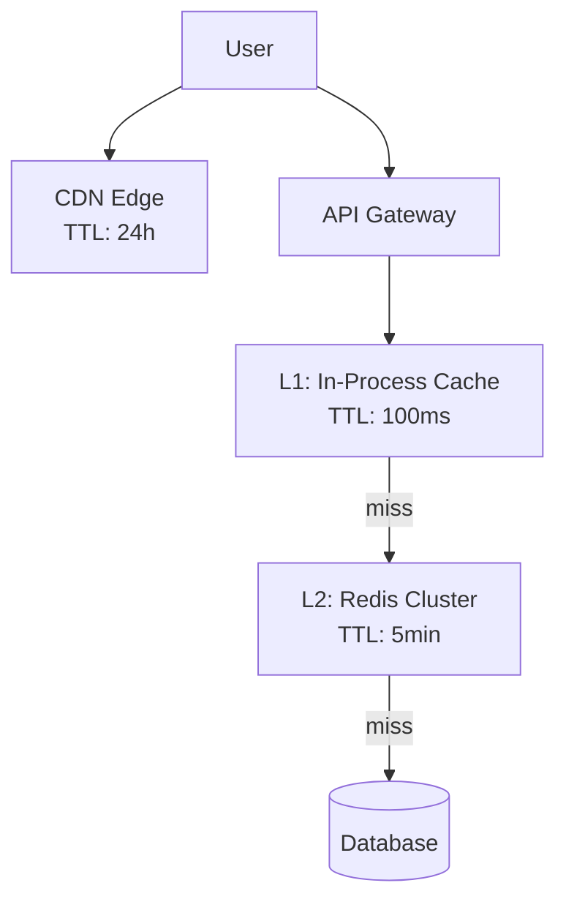

# Class 09 — Caching Patterns & Invalidation

> Quick architect notes · patterns → invalidation → staleness → full strategy

---

## The Big Picture

Caching sits between your app and the database to **cut latency** and **reduce DB load**. The four topics build in order:

```
Define SLA → Pick Pattern → Choose Invalidation → Set Staleness Budget → Compose Strategy
```

| Metric | Typical Range |
|--------|---------------|
| Cache hit rate | 85–99% |
| Latency reduction | 10–100× |
| DB load reduction | 60–95% |

---

## 1. Cache Patterns

**Core question:** *Who reads/writes the cache — the app or the cache layer itself?*

### Cache-Aside (Lazy Loading) — Most Common



**Real case:** Amazon product pages — app checks Redis first, loads PostgreSQL on miss.

| Pros | Cons |
|------|------|
| Only hot keys cached | First request is slow (miss) |
| Cache failure doesn't block reads | App must handle cache logic |
| Most flexible | Race condition on concurrent writes |

**Use when:** Read-heavy APIs (90% of web services).

---

### Read-Through



**Real case:** Hibernate second-level cache — developer writes one line: `cache.get(key)`.

**Use when:** You want the cache SDK/ORM to abstract DB loading.

---

### Write-Through



**Real case:** Login session store — must be consistent immediately after write.

**Use when:** Strong consistency required (sessions, auth tokens, config).

---

### Write-Behind (Write-Back)



**Real case:** Twitter/X like counts — fast write to Redis, flush to Cassandra later.

**Use when:** High write throughput, slight DB delay is acceptable (counters, analytics).

---

### Pattern Cheat Sheet

| Pattern | Read Path | Write Path | Consistency |
|---------|-----------|------------|-------------|
| Cache-Aside | App → Cache → DB on miss | App writes DB, then invalidates cache | Eventual |
| Read-Through | Cache auto-loads on miss | App writes DB directly | Eventual |
| Write-Through | Cache → always fresh | Sync to cache + DB | Strong |
| Write-Behind | Cache (may be ahead of DB) | Cache first, async DB | Eventual |

---

## 2. Cache Invalidation

**Core question:** *How does the cache know data changed?*

> *"There are only two hard things in CS: cache invalidation and naming things."*

### Four Methods

```
┌─────────────────┬──────────────────────────────────────────────────┐
│ Method          │ How it works                                     │
├─────────────────┼──────────────────────────────────────────────────┤
│ TTL             │ Key expires after N seconds — zero coordination    │
│ Write-Invalidate│ DELETE key on write; next read reloads fresh       │
│ Event-Driven    │ DB write → Kafka/PubSub → all nodes invalidate   │
│ Versioning/Tags │ Tag keys by entity; invalidate entire tag group    │
└─────────────────┴──────────────────────────────────────────────────┘
```

### Invalidation Flow — Write-Invalidate



### Event-Driven (Multi-Region)



**Real case:** Shopify order placed → invalidate inventory cache across 12 regions.

### Method Comparison

| Method | Coordination Cost | Consistency | Best For |
|--------|-------------------|-------------|----------|
| TTL | None | Eventual (stale until expiry) | CDN, weather, static config |
| Write-Invalidate | Low | Good (1 slow read after write) | User profiles, CRUD APIs |
| Event-Driven | Medium | Strong-ish (ms–s propagation) | Multi-region inventory |
| Versioning/Tags | Medium | Strong for grouped entities | CMS pages, tagged content |

**Production tip:** Combine methods — e.g. `write-invalidate` + `TTL as safety net`.

---

## 3. Cache Staleness

**Core question:** *How wrong can cached data be before users or the business care?*

### Staleness Budget

Define the **maximum acceptable age** of cached data after a source-of-truth change.

```
Staleness Window = time between DB write and cache reflecting that write
```

| Staleness Level | User Impact | Example | Acceptable? |
|-----------------|-------------|---------|-------------|
| 0s | Always correct, higher latency | Bank balance, checkout inventory | Required |
| 1–5s | Invisible to most users | Social likes, view counts | Usually yes |
| 30s–5min | Noticeable in fast-changing data | News feed, stock ticker | Case by case |
| Hours+ | Only for slow-change data | CDN assets, static config | Yes |

### Staleness Timeline (after a write event)

```
TTL-only (300s):          ████████████████████░░░░  stale up to 5 min
Write-invalidate:         ████░░░░░░░░░░░░░░░░░░░░  stale ~1 read cycle
Event-driven:             ██░░░░░░░░░░░░░░░░░░░░░░  stale ~propagation delay
```

### Real Scenarios

**Flash sale (Amazon Prime Day)**
- Problem: TTL-only cache → users see old price for up to 5 min
- Fix: `write-invalidate` on price change + 30s TTL safety net

**Leaderboard scores**
- Problem: Over-engineering strong consistency wastes resources
- Fix: Accept 30s staleness; use write-behind counters

**Bank balance**
- Problem: Any staleness = regulatory violation
- Fix: No cache on balance, or write-through with immediate invalidation

---

## 4. Cache Strategy

**Core question:** *What is the full caching architecture for this service?*

### Decision Tree



### Multi-Layer Architecture



Each layer has its own TTL and invalidation scope. Request fans out top-down until a hit.

### Eviction Policies (when Redis memory is full)

| Policy | Evicts | Best For | Watch Out |
|--------|--------|----------|-----------|
| **LRU** | Least recently used key | General web caching | Scan attacks evict hot keys |
| **LFU** | Least frequently used key | Long-tail content, feeds | New keys evicted before warming |
| **TTL-only** | Keys past expiry | CDN, time-bound data | Memory fills before TTL expires |
| **Random** | Random key | Prototypes only | Unpredictable in production |

**Rule:** Always set `maxmemory` + eviction policy. Unbounded cache = OOM crash.

---

## Scenario Prescriptions

| Scenario | Pattern | Invalidation | Staleness Budget |
|----------|---------|--------------|------------------|
| E-commerce catalog | Cache-Aside | Write-Invalidate + 5min TTL | 30 seconds |
| Social feed likes | Write-Behind | TTL 60s + batch flush | 5–30 seconds |
| Bank balance | Write-Through | Write-Invalidate, no TTL | Zero |
| CDN static assets | Read-Through | TTL 24h + cache-bust on deploy | Hours |

---

## Interview One-Liner Template

> *"For `{service}`, I'd use **cache-aside** because reads dominate at 95:5.*
> *Invalidation via **write-invalidate + 5min TTL safety net**.*
> *Staleness budget is **30 seconds** — acceptable for product catalog, not for checkout inventory.*
> *Layers: L1 in-process (100ms) → L2 Redis cluster with LRU eviction and maxmemory at 80% RAM."*

---

## Key Takeaways

1. **Cache-Aside** is your default — know it cold.
2. **Never rely on TTL alone** for data that changes and matters.
3. **Define staleness budget first**, then pick invalidation to meet it.
4. **Combine methods** — write-invalidate + TTL safety net is production standard.
5. **Multi-layer** — CDN for static, Redis for hot keys, DB for truth.
6. **Always configure maxmemory** — unbounded cache kills the cluster.

---

*Next: Class 10 — Redis as a Building Block*
